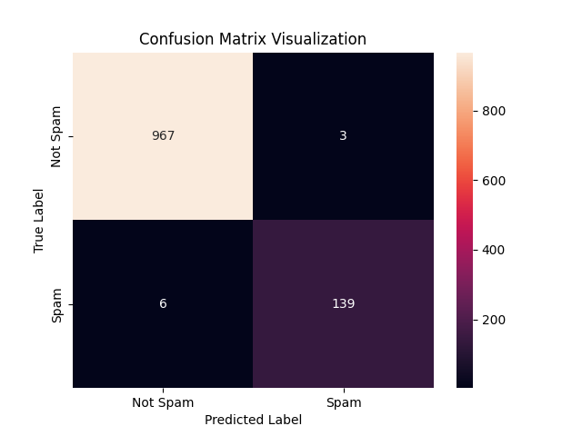

# 📩 SMS Spam Classification (Naive Bayes)
This project classifies SMS messages as Spam or Ham (Not Spam) using the Multinomial Naive Bayes algorithm. The model is built with scikit-learn and trained on the popular SMS Spam Collection dataset.

## 📊 Dataset
- Source: UCI Machine Learning Repository – SMS Spam Collection Dataset(https://archive.ics.uci.edu/dataset/228/sms+spam+collection)

Citation: Almeida, T.A., Hidalgo, J.M.G., & Yamakami, A. (2011). Contributions to the study of SMS spam filtering: new collection and results. Proceedings of the 11th ACM Symposium on Document Engineering (DocEng), pp. 259–262.

Dataset Details:

5,574 SMS messages manually labeled as:

-ham → Not Spam

-spam → Spam

Two columns:

-Category: Target label (ham or spam)

-Message: SMS content

##🚀 Project Workflow
1.Data Preprocessing
- Loaded dataset using pandas.
- Verified class distribution: ~87% ham, ~13% spam.
- Split into training and test sets (80% / 20%) using train_test_split.
- Converted text messages into token count vectors using CountVectorizer.
  
2.Modeling
-Used MultinomialNB from sklearn.naive_bayes to train on vectorized SMS messages.
-Wrapped preprocessing and modeling into a Pipeline for streamlined prediction.

3.Evaluation
- Generated classification report (precision, recall, f1-score, accuracy).
- Visualized confusion matrix using Seaborn.

## 📈 Confusion Matrix

Example of confusion matrix for the test set:



## ⚙️ Installation

1. Clone the repo:

```bash
git clone https://github.com/yourusername/spam_classification_naive_bayes.git
cd spam_classification_naive_bayes
```
2. **Install dependencies:**:   
```commandline
pip install -r requirements.txt
```


📂 Files in This Repo
- sms_spam_classification.ipynb: Main notebook with preprocessing, modeling, evaluation.
- requirements.txt: Python dependencies (e.g., pandas, scikit-learn, seaborn, matplotlib).
- images/confusion_matrix.png: Saved image of the confusion matrix plot.
  
## 👨‍💻 Author

Yoseph Negash

📧 yosephn22@gmail.com

📅 2025
